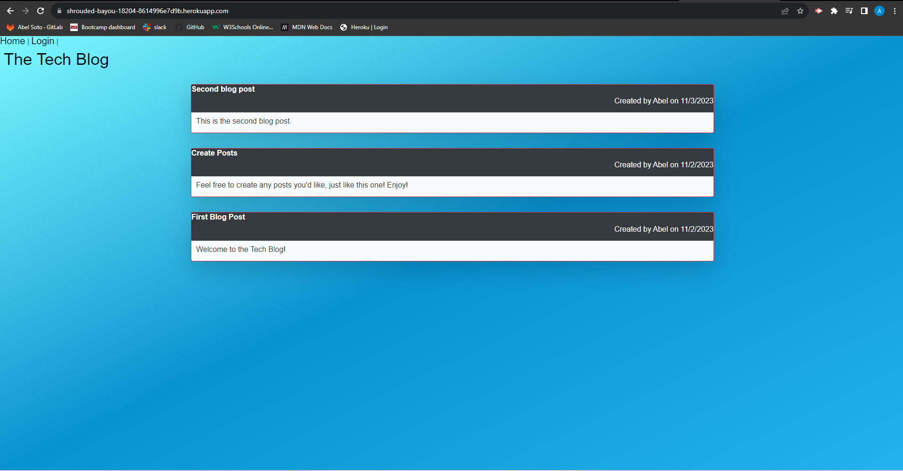

# tech-blog

## Table of Contents
1. [Description](#description)
2. [Installation](#installation)
3. [Usage](#usage)
4. [License](#license)
5. [Screenshot](#screenshot)
6. [Questions](#questions)

## Description
This project was aimed towards creating a tech blog using the MVC paradigm and using the Handlebars.hs as the templating languate. This website allows users to create an account, log in, create posts, and edit/delete their own posts. This application was created using Node.js, Express.js, mySQL, Sequelize, and Handlebars.js. The application is deployed on Heroku and can be found here: https://shrouded-bayou-18204-8614996e7d9b.herokuapp.com/

## Installation
To install, please ensure you have Node.js installed. Clone the project repo to your computer. Once cloned, open up the command line and type "npm i" to install all dependencies.

## Usage 
To use this application, please visit the site listed at ...... Once there, you can create an account, log in, create posts, and edit/delete your own posts, along with viewing other users posts and seeing when they were made. 
## License 
Please refer to the license in the GitHub Repository.

## Screenshot 

## Questions 
You can find me [HERE](https://github.com/asoto225) on Github
You can email me at abelsoto12@hotmail.com if you have any additional questions.